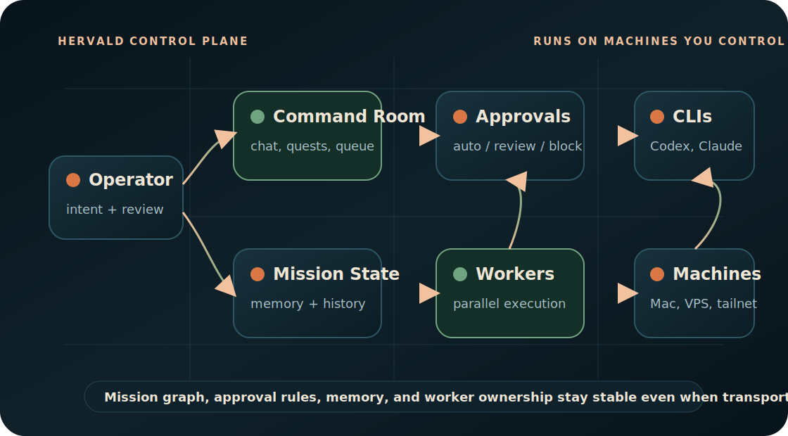

<p align="center">
  
</p>

<p align="center">
  <a href="#quickstart"><strong>Quickstart</strong></a> &middot;
  <a href="./docs/index.md"><strong>Docs</strong></a> &middot;
  <a href="./docs/reference/cli.md"><strong>CLI</strong></a> &middot;
  <a href="./docs/operate/machines.md"><strong>Machines</strong></a> &middot;
  <a href="./docs/troubleshoot.md"><strong>Troubleshooting</strong></a> &middot;
  <a href="https://hervald.gehirn.ai"><strong>Website</strong></a>
</p>

<p align="center">
  <a href="./LICENSE"></a>
  <a href="./docs/llms.txt"></a>
  <a href="https://hervald.gehirn.ai/install.sh"></a>
</p>

# Hervald is the agent orchestration OS.

Cursor is obsolete. Pair-programming with one chatbot is a dead end; the next interface is a fleet of agents running on machines you control, holding persistent memory, and answering to an approval system you own.

Hervald owns mission state, worker orchestration, memory, approvals, and the command-room surface. Connectivity is delegated to infrastructure you already trust: SSH, Tailscale, hosted runtimes, and your own reverse proxy. The mission graph and execution rules stay stable even when the underlying transport changes.

**Manage agent work, not terminal tabs.**

| Step | Operator action | Hervald outcome |
| --- | --- | --- |
| **01** | Install the control plane on a trusted machine. | Hermetic Node/pnpm toolchain, local env, server boot, and bootstrap sign-in. |
| **02** | Connect provider auth and machines. | Codex, Claude Code, Gemini CLI, OpenCode, local hosts, SSH boxes, and Tailscale machines become explicit runtime targets. |
| **03** | Run commanders and workers from Command Room. | Work is queued, delegated, reviewed, remembered, and recoverable. |

## What Hervald Is

Hervald is a source-available control plane for personal agent fleets.

It looks like an operating room for agent work. Under the hood: commanders, workers, persistent memory, provider readiness, machine routing, action policies, approvals, public docs, and an install path that keeps the runtime on infrastructure you own.

```text
operator intent -> command room -> mission state -> approval policy -> worker fleet -> provider CLI -> your machine
```

## Hervald Is Right For You If

- You coordinate more than one AI agent and need a persistent command surface.
- You run work on a Mac mini, VPS, EC2 box, or tailnet machine and want the control plane there too.
- You want agents to keep mission memory across provider sessions, browser tabs, and worker restarts.
- You need sensitive actions to be reviewable instead of blindly executed.
- You want public, agent-readable docs that describe setup, operations, references, and recovery.

## Quickstart

The installer is hermetic for the Node toolchain. It needs `git`, `curl`, `tar`, and outbound HTTPS; it installs Node `22.12.0` and pnpm `10.23.0` in a local toolchain directory without replacing or relying on your system Node.

```bash
curl -fsSL https://hervald.gehirn.ai/install.sh | bash
```

The installer clones Hervald, prepares the local app environment file, installs the hermetic toolchain and dependencies, builds the app, boots the shell once, seeds a one-time bootstrap API key, and prints the local sign-in URL.

Continue with the [full quickstart](./docs/getting-started/quickstart.md) to complete first-run onboarding, provider auth, machine readiness, and the first useful commander run.

## Feature Matrix

<table>
<tr>
<td width="33%"><strong>Commanders</strong><br/>Durable agent identities with memory, conversations, quests, and worker ownership.</td>
<td width="33%"><strong>Workers</strong><br/>Delegated execution sessions on local hosts, SSH machines, Mac minis, or Tailscale boxes.</td>
<td width="33%"><strong>Approvals</strong><br/>Action policy can auto-run, queue for review, or block external actions.</td>
</tr>
<tr>
<td><strong>Provider Auth</strong><br/>Uses provider CLIs where they already run instead of hiding credentials in a black box.</td>
<td><strong>Workspace Context</strong><br/>Commanders operate in real repos with file context, route-aware prompts, and durable traces.</td>
<td><strong>Public Docs</strong><br/>Human docs plus `llms.txt` cover setup, concepts, operations, references, and troubleshooting.</td>
</tr>
</table>

## Problems Hervald Solves

| Without Hervald | With Hervald |
| --- | --- |
| One chatbot owns the conversation, state, and bottleneck. | Commanders assign parallel workers while Command Room keeps the mission coherent. |
| Agent sessions vanish when a tab, machine, or provider session dies. | Mission state, memory, approvals, and history persist outside any single transport. |
| Remote machines and local laptops require bespoke scripts and manual tracking. | Machines are registered, checked for readiness, and used as explicit worker execution targets. |
| External actions either run blindly or require constant babysitting. | Action policies make approval, auto-run, and block behavior inspectable and adjustable. |

## Bundled Commander Workforce

Fresh Hervald installs include a backend-owned commander marketplace and a starter workforce:

- **Asina**: engineering manager for issue triage, code investigation, review, orchestration, and release follow-through.
- **Einstein**: research intelligence analyst for web research, knowledge search, domain distillation, and reports.
- **Alfred**: general assistant for meeting prep, scheduling support, inbox/doc triage, and daily follow-through.

Open the Marketplace page or complete first-run onboarding to install the starter workforce. Packages are inspectable in the bundled commander package directory; each package contains `COMMANDER.md`, `skills.manifest.json`, `memory-seed.md`, `onboarding.md`, and examples. The required starter skill dependencies ship in `agent-skills/hervald-starter/` so a fresh public checkout has the workflows the bundled commanders advertise.

## Deploy Shapes

| Shape | Use it when | Docs |
| --- | --- | --- |
| **Mac mini / workstation** | You want a personal operator box on a machine you already control. | [Quickstart](./docs/getting-started/quickstart.md) |
| **EC2 / VPS** | You want a shared host behind your own reverse proxy or load balancer. | [Machines and workers](./docs/operate/machines.md) |
| **Railway** | You want the fastest hosted control-plane path while workers stay on machines you control. | [Quickstart](./docs/getting-started/quickstart.md) |

## Docs

Full documentation lives under [`docs/`](./docs/index.md):

- [Quickstart](./docs/getting-started/quickstart.md)
- [Provider auth](./docs/operate/provider-auth.md)
- [Machines and workers](./docs/operate/machines.md)
- [Workspace](./docs/operate/workspace.md)
- [Channels](./docs/operate/channels.md)
- [Commanders](./docs/concepts/commanders.md)
- [Workers](./docs/concepts/workers.md)
- [Command Room](./docs/concepts/command-room.md)
- [Approvals](./docs/concepts/approvals.md)
- [CLI reference](./docs/reference/cli.md)
- [API reference](./docs/reference/api.md)
- [Naming policy](./docs/reference/naming.md)
- [Troubleshooting](./docs/troubleshoot.md)
- [Agent-readable llms.txt](./docs/llms.txt)

## License

Hervald is source-available under the [PolyForm Noncommercial 1.0.0](./LICENSE) license.

- Personal and other noncommercial use is allowed under that license.
- Commercial use requires a separate written agreement.
- See [COMMERCIAL-LICENSE.md](./COMMERCIAL-LICENSE.md) and [NOTICE](./NOTICE).
