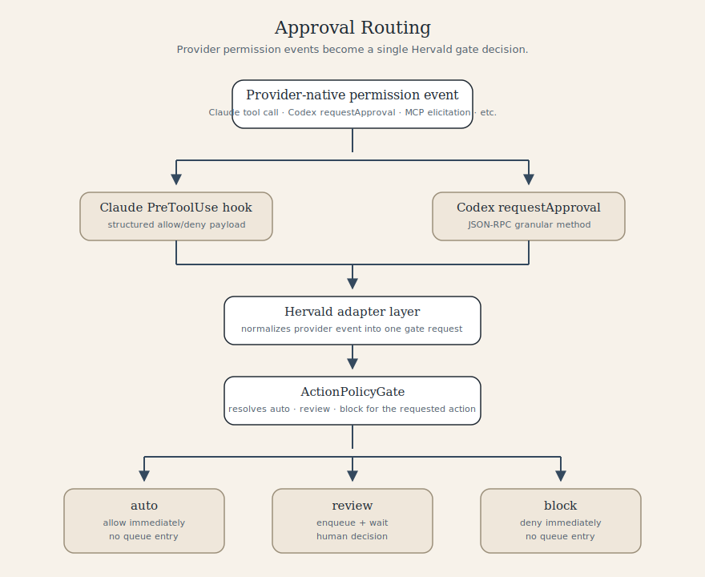
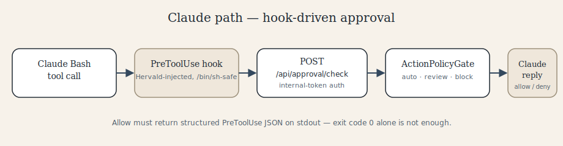
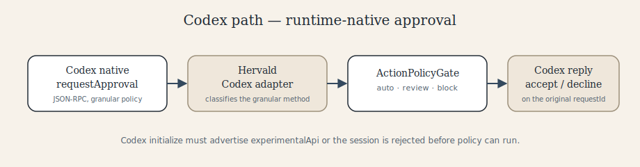
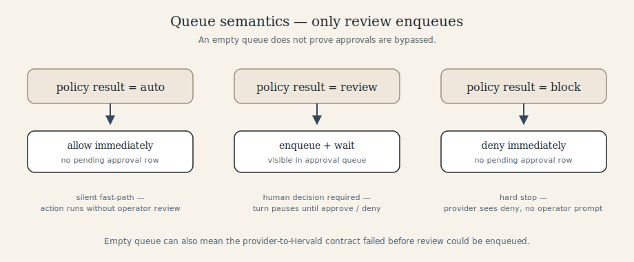
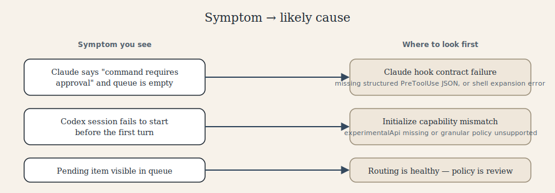

# Provider Approval Routing

This document is the operator-facing explanation of how Hervald handles tool approvals for provider runtimes.

Desired outcome:
- approval stays enabled by default
- provider-native permission requests route through Hervald policy
- `auto` actions run without human review
- `review` actions surface in Hervald's approval queue
- `block` actions stop immediately

Internal implementation details live in [../modules/policies/README.md](../modules/policies/README.md).

## Overview



Legend:
- `adapter layer`: translates provider-specific events into one Hervald gate request.
- `ActionPolicyGate`: resolves the effective action policy for the current session and action.
- `review`: the only branch that creates a pending approval queue item.

## Default Model

Hervald does not disable provider approvals and does not rely on project-local allowlists as the primary control plane.

- Claude runs with a `PreToolUse` hook and asks Hervald before each approval-relevant tool call.
- Codex runs with granular approval policy enabled and sends native approval requests back through Hervald.
- Hervald owns the allow / review / block decision after the provider emits an approval-relevant event.

## Claude Path

Claude approval detection is hook-driven.



Important invariants:
- Claude `auto` allow must be returned as structured `PreToolUse` JSON on stdout.
- Exit code `0` by itself is not enough.
- Claude executes hook `command` strings through `/bin/sh`, so inline `node -e` hook scripts must be shell-escaped.

Required allow shape:

```json
{
  "hookSpecificOutput": {
    "hookEventName": "PreToolUse",
    "permissionDecision": "allow"
  }
}
```

If Claude shows `This command requires approval` while Hervald has no pending approval item, suspect a Claude hook contract failure first, not policy propagation.

## Codex Path

Codex approval detection is runtime-native.



Important invariants:
- Codex sessions still start with granular `approvalPolicy`.
- Codex runtime initialization must advertise `experimentalApi` capability.
- If `experimentalApi` is missing, Codex rejects the session before Hervald policy can run.

Typical startup failure when that capability is missing:

```text
askForApproval.granular requires experimentalApi capability
```

### Granular Approval Methods Hervald Recognizes

The Codex transport opts in to all five granular approval categories
(`sandbox_approval`, `mcp_elicitations`, `rules`, `request_permissions`,
`skill_approval`). Each category surfaces as a JSON-RPC `requestApproval`
method that Hervald classifies and routes through the unified action
policy gate:

| Method                                      | Action ID                   | UI Label             |
|---------------------------------------------|-----------------------------|----------------------|
| `item/commandExecution/requestApproval`     | `codex-command-execution`   | Command Execution    |
| `item/fileChange/requestApproval`           | `codex-file-change`         | File Change          |
| `item/permissions/requestApproval`          | `codex-permissions-request` | Permission Expansion |
| `item/mcpToolCall/requestApproval`          | `codex-mcp-tool-call`       | MCP Tool Call        |
| `item/rules/requestApproval`                | `codex-rules-consultation`  | Rules Consultation   |
| `item/skill/requestApproval`                | `codex-skill-execution`     | Skill Execution      |

### Unknown Approval Method Safety Net

If Codex emits a `requestApproval` JSON-RPC method that Hervald does not
yet classify, the Codex adapter:

1. Sends a structured `{ decision: 'decline' }` response on the original
   `requestId` so the Codex sidecar is never blocked.
2. Emits a `system` event naming the unhandled method so the operator sees
   the explicit decline instead of a silent stall.
3. Increments a per-turn unclassified counter so the watchdog stale-event
   message can surface the exact method name and count if the turn still
   later goes silent.
4. Logs a `warn` entry with the method, threadId, and requestId.

This guarantees that even when Codex introduces new granular categories
that Hervald has not been taught yet, the operator gets a deterministic
state transition rather than a 300-second silent timeout.

## Queue Semantics

Only `review` creates a visible pending approval in Hervald.



That means an empty approval queue does not prove approvals are bypassed. It often means one of these is true:
- the action resolved to `auto`
- the action resolved to `block`
- the provider-to-Hervald contract failed before a `review` request could be enqueued

## Failure Modes We Fixed

### 1. Claude allow reply was incomplete

Problem:
- Hervald returned success from the hook process, but did not emit the structured Claude `PreToolUse` allow payload.

Effect:
- Claude ignored the auto-allow and fell back to its own native permission layer.
- The user saw `This command requires approval`.

Fix:
- Claude auto-allow now returns the required `hookSpecificOutput.permissionDecision = "allow"` payload.

### 2. Claude inline hook command was shell-unsafe

Problem:
- The inline `node -e "..."` hook command contained JavaScript template literals such as `${...}`.
- Claude runs hook commands through `/bin/sh`.
- `/bin/sh` expanded the inline script before Node executed it.

Effect:
- the hook failed before contacting Hervald
- no approval reached the queue
- Claude fell back to native approval denial

Typical transcript symptoms:

```text
/bin/sh: ... bad substitution
Expected unicode escape
hook_non_blocking_error
```

Fix:
- shell-escape the inline hook command before passing it to Claude

### 3. Codex initialize handshake was incomplete

Problem:
- Hervald enabled granular approval for Codex but did not advertise `experimentalApi` on `initialize`.

Effect:
- Codex rejected session startup with a 500 before Hervald policy could evaluate anything.

Fix:
- advertise `initialize.capabilities.experimentalApi = true`

## Troubleshooting

When approval behavior looks wrong, check in this order:

1. Confirm the running Hervald build includes the expected fix.
2. Determine the provider: Claude and Codex have different native approval surfaces.
3. Check whether the action should be `auto`, `review`, or `block`.
4. If the queue is empty:
   - for Claude, inspect the transcript for `hook_non_blocking_error`
   - for Codex, inspect runtime startup / initialize errors
5. Verify the provider event can reach `POST /api/approval/check`.

Quick interpretation guide:



## Practical Expectation

With the intended design in place:
- safe internal actions can auto-run without queue noise
- sensitive actions surface in Hervald's approval queue
- providers do not silently keep their own independent approval policy
- Claude and Codex both use provider-native permission transports, but Hervald remains the decision point
