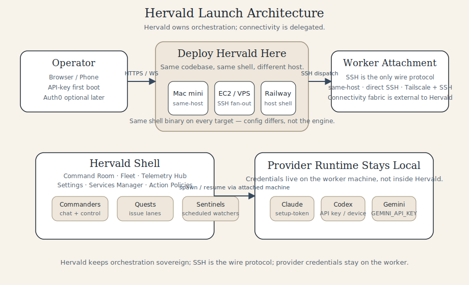

# Hervald Architecture Overview

Hervald owns orchestration; connectivity is delegated.



## Core Model

```
Browser / Mobile
       │ HTTPS / WS
       ▼
┌──────────────────────┐
│ Hervald shell        │
│ apps/hammurabi       │
│ - command room       │
│ - fleet / telemetry  │
│ - approvals / keys   │
└──────────┬───────────┘
           │ SSH (direct or via Tailscale)
           ▼
┌──────────────────────┐
│ Attached worker box  │
│ - same host          │
│ - remote VM / Mac    │
│ - tailnet peer       │
└──────────┬───────────┘
           │ local process spawn
           ▼
 Claude Code / Codex / Gemini / Cursor / custom runtimes
```

## What Hervald Owns

- Session orchestration, routing, and recovery.
- Commander workflows, quests, sentinels, and approvals.
- API-key auth by default, with Auth0 optional.
- Telemetry ingest, cost tracking, and operator-facing state.

## What Hervald Does Not Own

- Provider login state for Claude, Codex, Gemini, Cursor, or other tools.
- Remote connectivity fabric beyond SSH reachability.
- A daemon transport layer for Phase 1.

## Supported Worker Patterns

| Pattern | When to use it | What changes |
| --- | --- | --- |
| Same-host | Single box deployment | Nothing special. Hervald spawns tools on the local machine. |
| Direct SSH | Dedicated worker VM or Mac | Register the host and bootstrap it with `hammurabi machine bootstrap`. |
| Tailscale + SSH | Private workers across NAT/VPC boundaries | Tailscale supplies reachability. Hervald still uses normal SSH. |

## Deployment Targets

| Target | Best for | Notes |
| --- | --- | --- |
| Mac mini | Personal or lab deployment | Simplest path when the same machine also owns provider logins. |
| EC2 / VPS | Always-on operator box | Good when you want stable SSH fan-out to workers. |
| Railway | Hosted control plane | Keep workers attached over SSH or Tailscale; Railway hosts orchestration, not provider creds. |

## Commander Memory Model

Hervald’s commander runtime is intentionally layered:

1. Task pickup context: the current issue, handoff, and live session state.
2. Long-term memory: durable facts in `.memory/MEMORY.md` and related memory files.
3. Working scratchpad: short-horizon notes in `.memory/working-memory.md` and indexed transcript recall when you need prior execution context.

That layering is already implemented in `modules/commanders/memory/**`. Phase 1 keeps the model; it does not add a new memory subsystem for the public repo.

## Approval and Auth Defaults

- First boot defaults to API-key sign-in. Leaving `AUTH0_*` unset is the supported zero-config path.
- `HAMMURABI_ALLOW_DEFAULT_MASTER_KEY=1` is an installer-only first-boot toggle. It seeds a one-time bootstrap key and writes it to `~/.hammurabi/bootstrap-key.txt`.
- Auth0 stays optional for operators who want SSO later.

## Related Docs

- [Installation](./installation.md)
- [Tailscale Quickstart](./tailscale-quickstart.md)
- [Provider Auth Setup](./provider-auth-setup.md)
- [Operator Guide](./operator-guide.md)
- [Approval Routing](./approval-routing.md)

## Canonical Report

For the longer architecture argument behind “SSH, not daemon transport”, see the [canonical architecture report](https://www.nickgu.me/reports/hammurabi-daemon-vs-ssh-2026).
